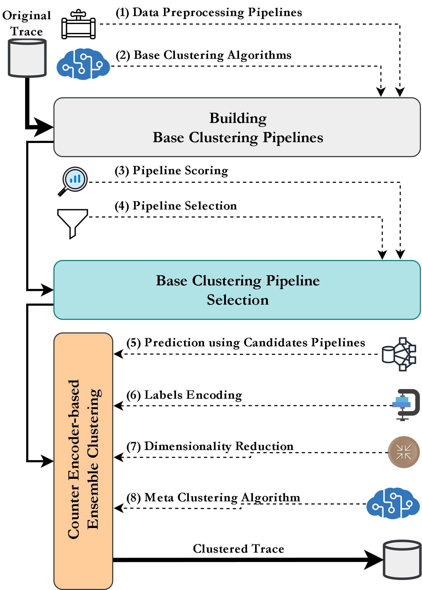

# An Ensemble Clustering Approach for Modeling Hidden Categorization Perspectives for Cloud Workloads
Cluster Computing (2023), the Journal of Networks, Software Tools and Applications.

## Abstract
Effectively managing cloud resources is a complex task due to the interdependencies of various cloud-hosted services and applications. 
This task is integral to workload categorization, which groups similar cloud workloads to inform scheduling and resource management procedures. Although traditional clustering algorithms can categorize workloads into single data grouping patterns, the multifaceted nature of cloud workloads may conceal multiple valid categorization perspectives, indicating a need for a more adaptable clustering approach. This paper presents a novel ensemble clustering approach to enhance the categorization process for scheduling workloads in cloud data centers. This approach combines various normalization and transformation techniques, including Principal Component Analysis, to create multiple data preprocessing pipelines. The data derived from these pipelines serves as input for different base-clustering models. To improve the accuracy of selecting optimal base-clustering models and preprocessing pipelines, we utilize a combined score based on the Silhouette score, Calinski-Harabasz index, and Davies-Bouldin index. The clustering outcomes of these models are encoded and inputted into a meta-clustering algorithm, effectively capturing complex categorization perspectives.The assessment of this approach, utilizing authentic workload trace data from Microsoft Azure, significantly enhances workload segmentation efficacy. Consequently, this improvement elevates resource management and quality of service standards in cloud data centers. It offers a promising path toward improved workload clustering in cloud systems, demonstrating the practical utility of advanced ensemble clustering techniques to unveil hidden categorization perspectives.

Figure 1: The Proposed Ensemble Clustering Framework.
